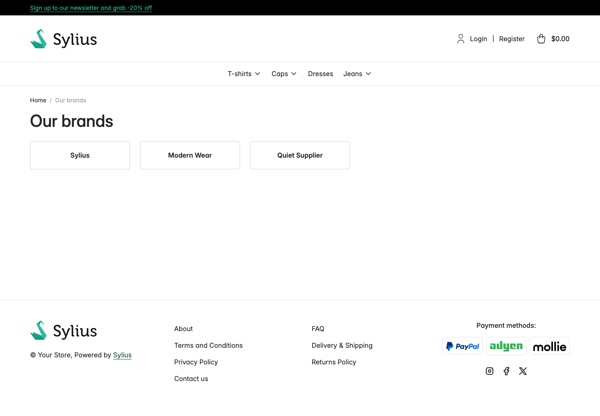
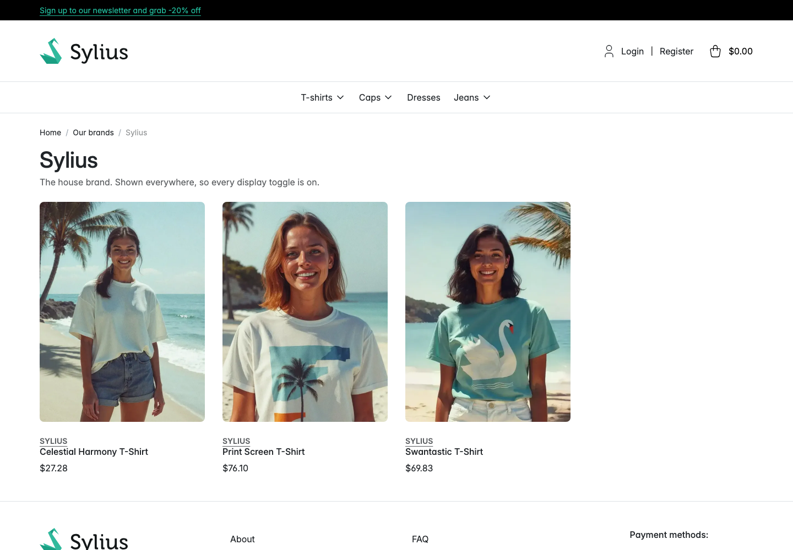
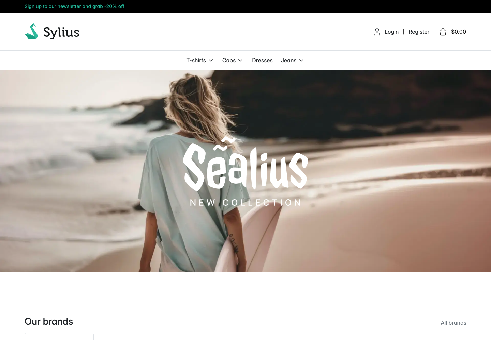

# Brands in the shop

This page is for shoppers as much as for administrators. It describes what the plugin puts on the
storefront and, for each surface, which setting controls it.

Everything here requires **Enable brands** to be on for the channel. With it off, the brand pages
return 404 and the badges render nothing.

## The brand overview

**Address:** `/brands`, under your shop's locale prefix, for example `/en_US/brands`.

The page is headed **Our brands** and shows a grid of brand cards, each with the brand's logo and
name, or just the name where no logo has been uploaded. Select a card to open that brand's own
page. The breadcrumb is **Home** then **Our brands**.

A brand is listed here when all of the following are true:

- The brand is **Enabled**.
- Its **Display on the brand overview** toggle is on.
- It has a name and a slug in the locale you are browsing in.

Brands are ordered by **Position** ascending, then by name. In the sample store the admin grid
holds five brands and the overview lists three: White Label is enabled but has its overview toggle
off, and Retired Brand has the toggle on but is not enabled.

**When there are no brands to show,** the page still loads and shows the message *There are no
brands to show yet.* rather than an empty grid.

## One brand's products

**Address:** `/brands/{slug}`, for example `/en_US/brands/sylius`.

The page header carries the brand's logo, its name as the page heading, and its description. Below
that is a listing of the products that resolve to this brand, using the same product cards as the
rest of the shop. The breadcrumb is **Home** then **Our brands** then the brand name.

- Products are listed 12 to a page, ordered by name. Use the pagination below the grid for the
  rest.
- Only products available in the channel you are browsing are listed.
- The page title is the brand name, and the brand's **Meta description** and **Meta keywords** are
  written into the page's meta tags.

**When the brand has no products in this channel,** the header still renders and the message *There
are no products for this brand in this channel yet.* is shown in place of the grid.

The page returns 404 when the brand does not exist, is not enabled, has no slug in this locale, or
has **Display on the brand overview** off. A brand you deliberately keep off the overview cannot be
reached by guessing its URL.

## The homepage brand strip

Directly under the homepage banner the plugin adds a section headed **Our brands**, with an **All
brands** link to `/brands` and a row of brand logos. Each one links to that brand's page. A brand
with no logo shows its name instead.

A brand appears in the strip when it is **Enabled** and its **Display on the homepage** toggle is
on, ordered by **Position** then name. In the sample store one brand, Sylius, meets that condition.

**When no brand has the homepage toggle on,** the whole section is left out. There is no empty
heading.

## The brand badge on a product page

The badge sits directly under the product name, above the review stars. It reads **Brand:** and
then the brand name, linking to the brand's page. Where the brand has a logo, the logo is shown
before the label.

It appears when the product resolves to a brand, that brand is **Enabled**, and the brand's
**Display on the product page** toggle is on. Otherwise nothing is rendered, and the product page
looks exactly as it did before the plugin was installed.

If the brand's **Display on the brand overview** toggle is off, the brand name is still shown but
as plain text, because there is no reachable page to link to.

## The brand on product tiles

On a product card the brand appears as a small uppercase line between the product image and the
product name, without a logo. It links to the brand's page. This works on any listing that uses
Sylius' product card, including taxon listings, the homepage product rows and the brand pages
themselves.

A tile shows the brand when the product resolves to a brand, that brand is **Enabled**, and its
**Display on product tiles** toggle is on. Tiles are handled one by one, so a listing can mix
branded and unbranded cards: in the listing above only Celestial Harmony T-Shirt carries a brand
line, because only its brand has the tile toggle on.

## Accessibility

Brand logos use the brand name as their alternative text, so a screen reader announces the brand
even where the design shows only a logo. On the brand overview and the brand pages no image is
missing alternative text.

## Related

- [Managing brands](managing-brands.md) for the display toggles
- [Brand settings](brand-settings.md) for the feature toggle
- Walkthroughs: [Browse brands in the shop](../journeys/browse-brands-in-the-shop.md),
  [See the brand on a product](../journeys/see-the-brand-on-a-product.md)
