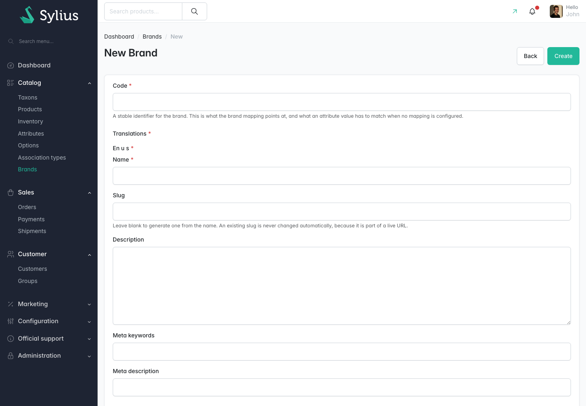

# Managing brands

Brands live in the admin under **Catalog** then **Brands**. A brand is a normal Sylius resource:
you create, edit and delete it from a grid, and its name, slug and description are translated per
locale.

## The Brands grid

The grid lists every brand, sorted by **Position** ascending. The footer tells you how many there
are, for example *Showing 1 to 5 of 5 entries*.

| Column | What it shows |
|---|---|
| **Logo** | The brand's logo. A dash means no logo has been uploaded |
| **Name** | The brand name in your current admin locale. Sortable |
| **Slug** | The slug used in the shop URL. Sortable |
| **Code** | The stable identifier the brand mapping and imports point at. Sortable |
| **Description** | The brand description |
| **Displayed on** | Badges for the display toggles that are on: **Homepage**, **Product page**, **Product tile**, **Brand overview**. A brand with none of them on reads **Nowhere** |
| **Products** | How many products currently resolve to this brand |
| **Position** | The order the brand takes on the brand overview. Sortable |
| **Enabled** | A tick or a cross. Sortable |
| **Actions** | Edit and delete |

Choose **Create** to open the new brand form. Each row has an edit action and a delete action.

The **Displayed on** and **Products** columns together answer most questions about a brand at a
glance. In the sample store above, Sylius carries all four badges and has 3 products, Quiet
Supplier is on the brand overview only, and Retired Brand has badges but is not enabled, so none of
them apply.

### Filtering

Choose **Filters** to open the filter panel, then **Filter** to apply it or **Reset** to clear it.

| Filter | Effect |
|---|---|
| **Search** | Matches on the brand code and the brand name |
| **Enabled** | **All**, **Yes** or **No** |
| **Display on the homepage** | **All**, **Yes** or **No** |
| **Display on the brand overview** | **All**, **Yes** or **No** |

**Show 25** changes how many rows are listed. The available page sizes are 25, 50 and 100.

### Deleting a brand

The delete confirmation tells you how many products will be affected before you commit:

> Deleting this brand will unbrand N product(s). They keep their attribute value, so re-running
> "madcoders:brand:resync-products" after creating a replacement brand will reattach them.

Deleting a brand does not touch the products themselves. Their brand attribute value stays exactly
as it was, so if you create a replacement brand with the same code and run
[the resync command](resyncing-product-brands.md), the products attach to it again.

The **Delete** button above the grid acts on selected rows and is disabled until you select at
least one.

## The brand form

The same form is used for **New Brand** and for editing an existing brand. Choose **Create** to save
a new brand, and **Back** to leave without saving. The screenshot shows the top of the form; the
logo, position, enabled flag and display toggles are further down the same page.

### Identification

| Field | Required | What it does |
|---|---|---|
| **Code** | Yes | A stable identifier for the brand. This is what the brand mapping points at, and what an attribute value has to match when no mapping is configured. Letters, digits, hyphens and underscores only, up to 64 characters, and unique across brands |

Treat the code as permanent. Changing it breaks every mapping row and every import that refers to
the old value, and products stop resolving until you fix both.

### Translated fields

Under **Translations** the form has one section per shop locale, headed with the locale code. Fill
in at least your default locale; the others are optional.

| Field | What it does |
|---|---|
| **Name** | The brand name shoppers see. Required. Up to 255 characters |
| **Slug** | The last part of the brand's shop URL, `/brands/{slug}`. Leave it blank to generate one from the name. An existing slug is never changed automatically, because it is part of a live URL. Slugs must be unique within a locale |
| **Description** | Free text shown on the brand's own page, under its name |
| **Meta keywords** | Written into the brand page's `keywords` meta tag. Up to 255 characters |
| **Meta description** | Written into the brand page's `description` meta tag. Up to 255 characters |

A brand with no translation in a shopper's locale, or with an empty slug in that locale, is left
out of the shop listings entirely. It has no name to show and no URL to link to.

### Logo

| Field | What it does |
|---|---|
| **Logo** | An image file. A brand has one logo. It appears in the grid, on the brand overview, on the brand's own page, on the homepage strip and on the product page badge |

The logo is optional. Where a logo would be shown and none exists, the brand name is shown instead.

### Ordering and availability

| Field | Default | What it does |
|---|---|---|
| **Position** | `0` | Lower numbers come first on the brand overview. Brands with the same position are ordered by name |
| **Enabled** | off | An unenabled brand is not listed anywhere in the shop and its own page is not reachable, whatever its display toggles say |

Leaving gaps between positions, as the sample store does with 0, 10, 20, 30 and 40, means you can
insert a brand later without renumbering the rest.

### The display toggles

Four checkboxes decide where an enabled brand is allowed to appear. They are independent of each
other, so a brand can be visible on product tiles but kept off the homepage.

| Toggle | Default | Effect when on |
|---|---|---|
| **Display on the homepage** | off | The brand is included in the homepage brand strip |
| **Display on the product page** | on | The brand badge is shown under the product name on every product that resolves to this brand |
| **Display on product tiles** | off | The brand name is shown on the product card in any listing |
| **Display on the brand overview** | on | The brand is listed at `/brands` |

**Display on the brand overview** does more than the other three. It also controls whether the
brand has its own product listing page: with it off, `/brands/{slug}` returns 404, and the brand
badge elsewhere in the shop shows the brand name as plain text instead of a link.

All four toggles only matter while the feature itself is on. See
[Brand settings](brand-settings.md).

## Accessibility

Brand logos are rendered with the brand name as their alternative text, in the grid and everywhere
in the shop. No image on the brand pages is missing alternative text.

## Related

- [Brand settings](brand-settings.md)
- [Brands in the shop](brands-in-the-shop.md)
- Walkthrough: [Create a brand](../journeys/create-a-brand.md)
