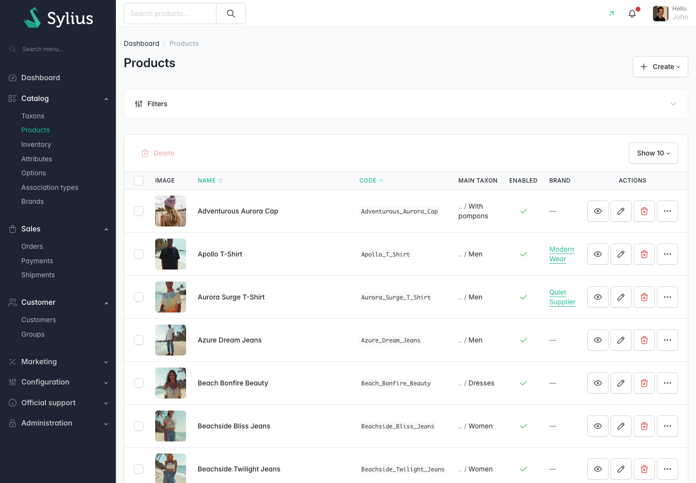

# Resyncing product brands

A product's brand is worked out from its brand attribute and stored on the product. That stored
link is refreshed automatically whenever a product is saved in the admin, but plenty of things
change a product, or change what a value means, without going through the admin.

`bin/console madcoders:brand:resync-products` recomputes the brand of every product in the
catalogue from its brand attribute.

## When to run it

- **After an import or a PIM sync.** A CSV import or a feed writes attribute values without going
  through the admin, so nothing recalculates the brand for those products.
- **After changing the brand mapping.** A new or edited mapping row retroactively changes what
  every product with that attribute value resolves to.
- **After changing the brand attribute** in **Settings** then **Brands**.
- **After creating a brand to replace a deleted one.** Deleting a brand unbrands its products but
  leaves their attribute values intact, so a resync reattaches them to the replacement.

It is safe to run whenever you are unsure. The command only ever recomputes what the current
settings say, so running it twice produces the same result as running it once. Running it more
often than necessary costs time and nothing else.

## Running it

```bash
bin/console madcoders:brand:resync-products
```

The command prints the brand attribute it is using and how many mapping entries it found, then
reports progress as it goes and finishes with a line like
`120 product(s) processed, 14 brand assignment(s) changed.`

### Options

| Option | Default | What it does |
|---|---|---|
| `--dry-run` | off | Reports what would change without writing anything. The summary says *would change* instead of *changed* |
| `--batch-size` | `200` | How many products to process before saving |

Use `--dry-run` first when you are checking the effect of a mapping change:

```bash
bin/console madcoders:brand:resync-products --dry-run
```

Lower `--batch-size` if the command is using more memory than you want to give it; raise it to
process a very large catalogue in fewer, larger writes.

### Messages you may see

| Message | What it means |
|---|---|
| `No brand attribute is configured. Set one in Admin → Settings → Brands before resyncing.` | **Brand attribute** has not been set. The command stops and does nothing |
| `Another resync is already running - exiting without doing anything.` | A second run started while the first was still going, for example a nightly cron overlapping with a deploy hook. Nothing is done twice |

The command works from the global **Brand attribute** and **Brand mapping** settings, so it gives
the same answer whether you run it from a cron job, a deploy hook or your own terminal. It does not
depend on the **Enable brands** toggle: it keeps the data correct even while the shop side is
switched off.

## Checking what a product resolved to

Two places in the admin answer this without going near the database.

### The product grid



The plugin adds a **Brand** column to **Catalog** then **Products**, and a **Brand** filter that
lists the brand codes. Use the filter to answer "which products ended up on this brand?", and the
column to spot products that ended up on none.

The brand is derived, so it is shown here but not editable. To change a product's brand, change its
brand attribute value or the brand mapping, then resync.

### The Brand panel on a product

Open a single product in the admin. Among the panels on its page is one headed **Brand**, which
spells out the whole resolution chain:

| Row | What it shows |
|---|---|
| **Brand attribute** | The attribute code configured in the settings |
| **Value on this product** | The product's value or values for that attribute |
| **Resolves to brand code** | What those values map to, after the brand mapping is applied |
| **Resolved brand** | The brand itself, linked to its edit page, or *None - this product is not attached to any brand.* |

Two situations get their own message:

- With no brand attribute configured: *No brand attribute is configured, so no product resolves to
  a brand. Set one in Settings -> Brands.*
- When the value resolves to a code but no brand has that code: *The attribute resolves to a brand
  code, but no brand with that code exists. Create one, or add a mapping entry pointing this value
  at an existing brand, then re-run "madcoders:brand:resync-products".*

## Related

- [Brand settings](brand-settings.md)
- [Managing brands](managing-brands.md)
