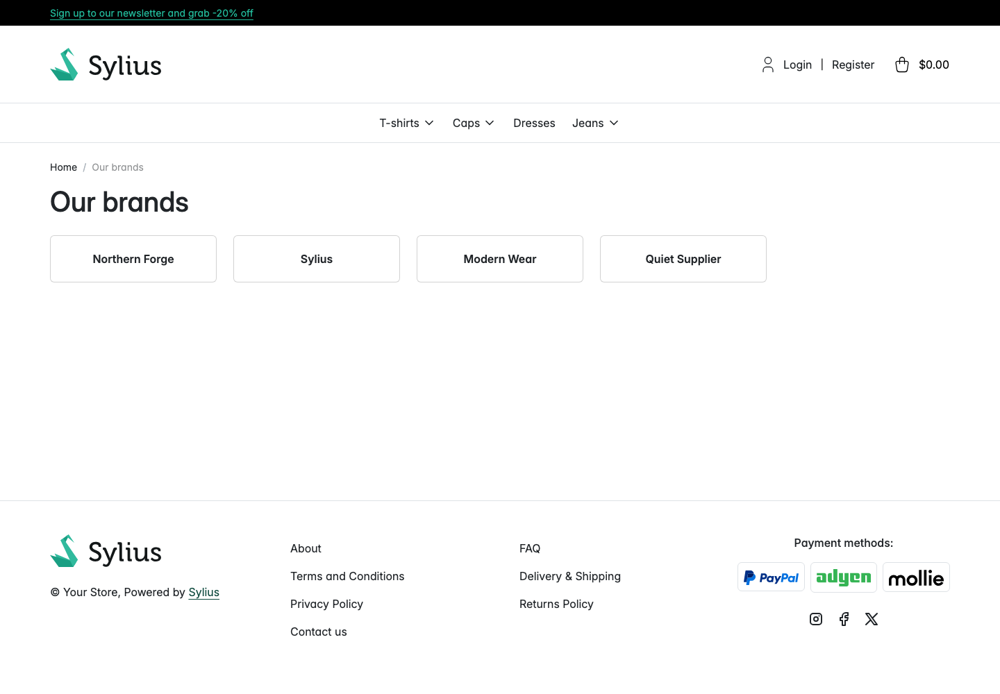
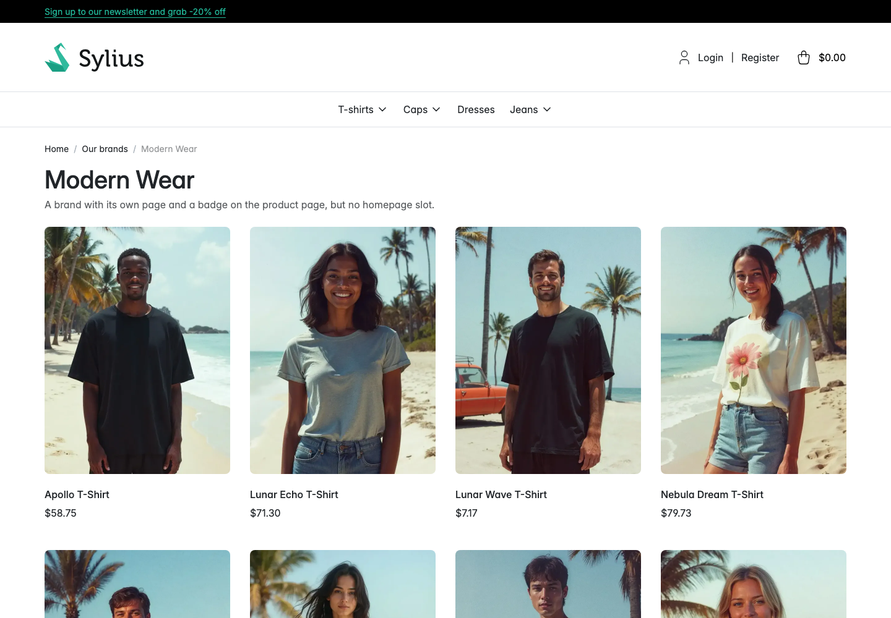

# Walkthrough: browse brands in the shop

**Who this is for:** a shopper. Administrators can use it to check their own setup.
**What you end up with:** you have seen every brand you publish, and reached one brand's products.

This walkthrough was replayed against a running store. Every step below completed.

## 1. Open the brand overview

Go to `/brands` under your shop's locale prefix, for example `/en_US/brands`. From the homepage you
can get there by selecting **All brands** next to the **Our brands** heading.

The page lists every brand that is enabled, has its **Display on the brand overview** toggle on,
and has a name and slug in the locale you are browsing. In this run that was Sylius, Modern Wear
and Quiet Supplier. Brands are ordered by **Position**, then by name.

## 2. Choose a brand

Select a brand card. In this run that led to `/en_US/brands/modern-wear`.

## 3. Read the brand and its products

The brand's own page shows its logo, its name as the heading and its description, with a listing of
that brand's products below. The breadcrumb is **Home** then **Our brands** then the brand name, so
you can go back to the overview from here.

Products are listed 12 to a page; use the pagination underneath for the rest. Only products
available in the channel you are browsing are shown, so a brand with nothing in this channel shows
*There are no products for this brand in this channel yet.* instead of a grid.

## If you get a 404 here

That is intentional in three cases:

- **Enable brands** is off for this channel. Then `/brands` itself is a 404 too.
- The brand is not **Enabled**.
- The brand has **Display on the brand overview** off. A brand kept off the overview cannot be
  reached by guessing its slug either.

See [Brands in the shop](../features/brands-in-the-shop.md).
