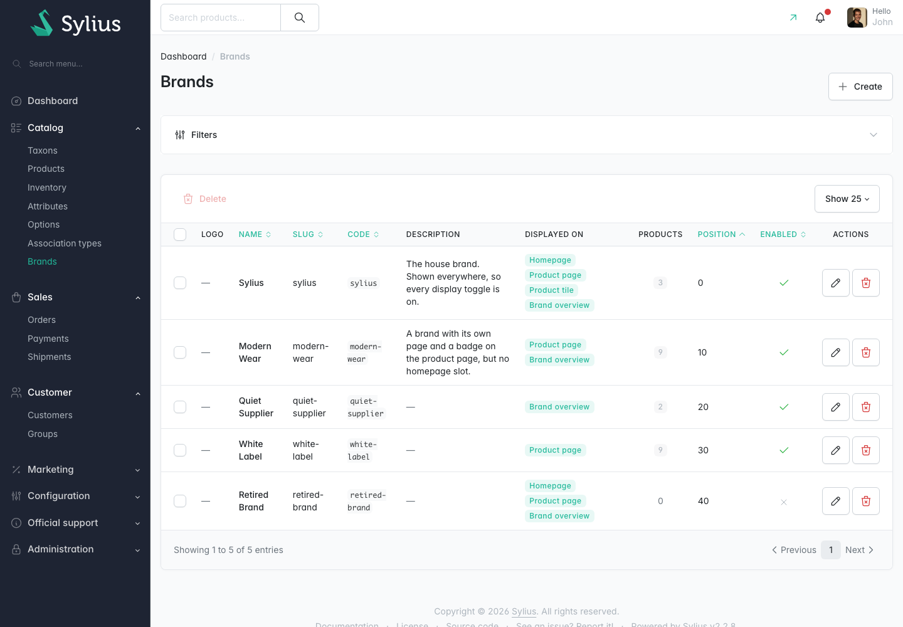
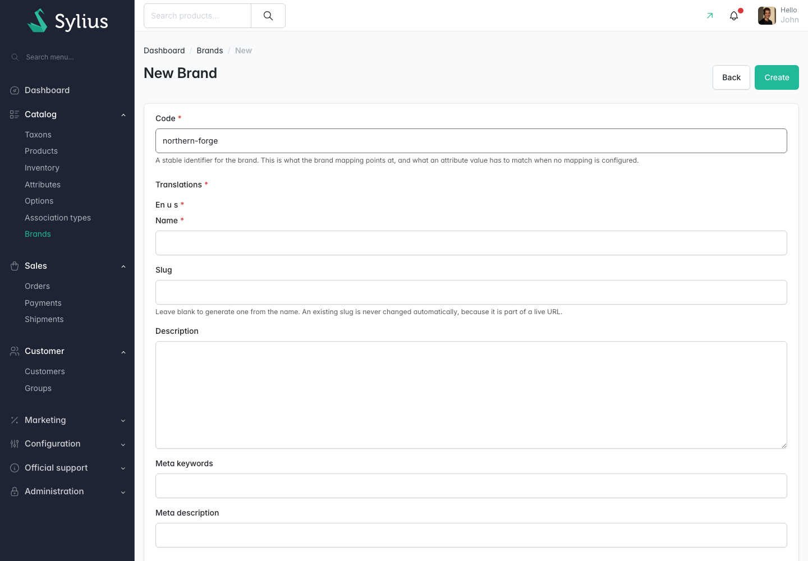
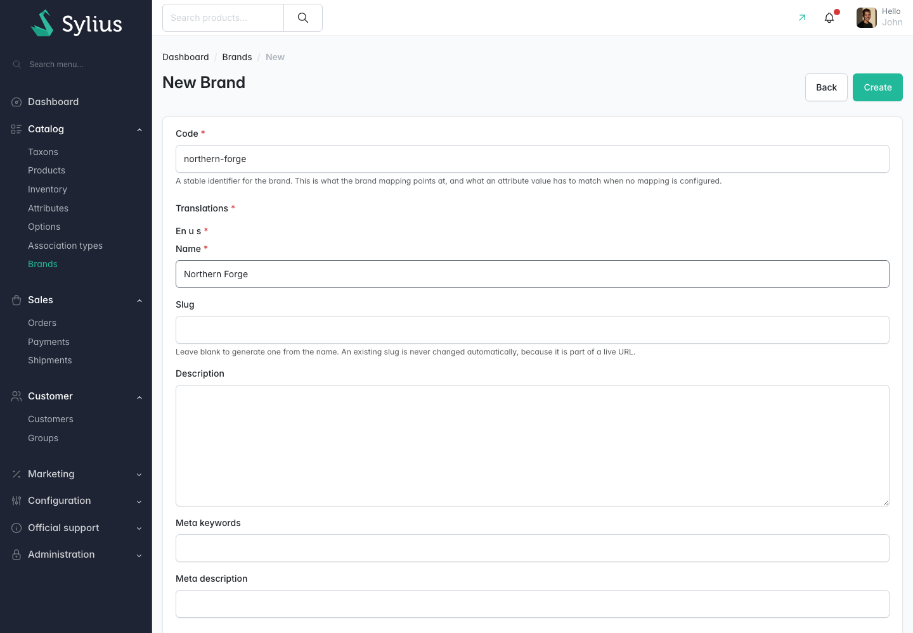
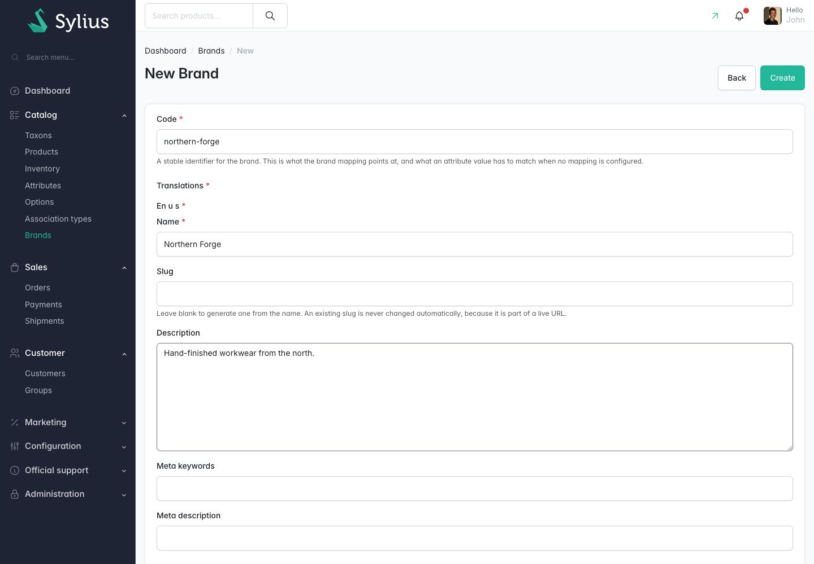
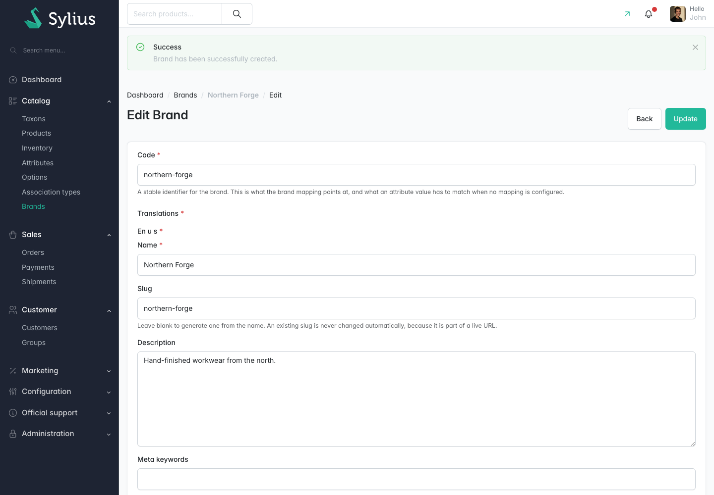

# Walkthrough: create a brand

**Who this is for:** a store administrator.
**What you end up with:** a new brand in the Brands grid, ready to be shown in the shop.

This walkthrough was replayed against a running store. Every step below completed.

## 1. Open the Brands grid

In the admin menu, open **Catalog** then **Brands**.

## 2. Start a new brand

Choose **Create**. The **New Brand** form opens.

## 3. Give the brand a code

Fill in **Code**. In this run the value was `northern-forge`.

This is what the brand mapping and your imports refer to, so keep it stable. Letters, digits,
hyphens and underscores only.

## 4. Enter the name

Fill in **Name** in your default locale section, under **Translations**. In this run the value was `Northern Forge`.

This is the name shoppers see. It is also what the **Slug** is generated from if you leave that
field blank.

## 5. Describe the brand

Fill in **Description** if you want one. In this run the value was
`Hand-finished workwear from the north.`

This text appears on the brand's own page, under its name.

## 6. Review the toggles before saving

Scroll down to **Enabled** and the four display toggles. Nothing in the shop shows this brand until
**Enabled** is on, and each of **Display on the homepage**, **Display on the product page**,
**Display on product tiles** and **Display on the brand overview** decides one place it can appear.

New brands start with **Display on the product page** and **Display on the brand overview** on, and
the other two off. See [Managing brands](../features/managing-brands.md) for what each one does.

## 7. Save

Choose **Create**.

The admin confirms with **Brand has been successfully created.** and takes you to the new brand's
edit page, where you can add the logo, adjust **Position** and fill in the other locales.

## 8. Check the result

The brand now exists and is listed in **Catalog** then **Brands**.

## What happens next

Creating a brand does not attach any product to it. Products reach a brand through their brand
attribute value, so:

1. Make sure a [brand attribute is configured](../features/brand-settings.md).
2. Make sure the products' attribute value matches this brand's code, or add a
   [brand mapping](../features/brand-settings.md) row that points the value at it.
3. Run [`madcoders:brand:resync-products`](../features/resyncing-product-brands.md) if the products
   were not saved through the admin since.
