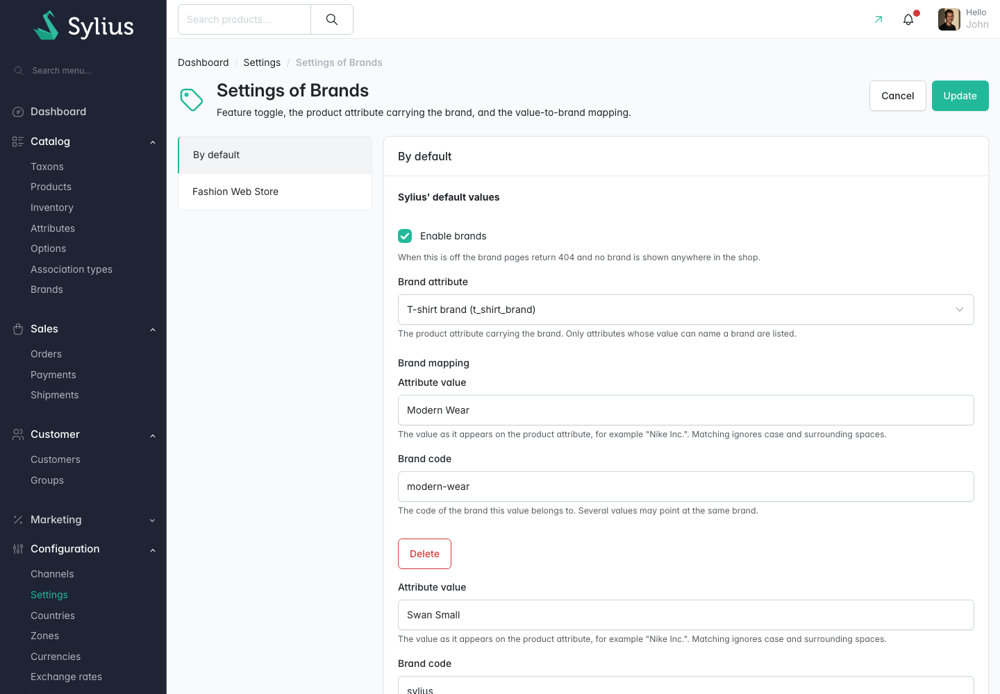
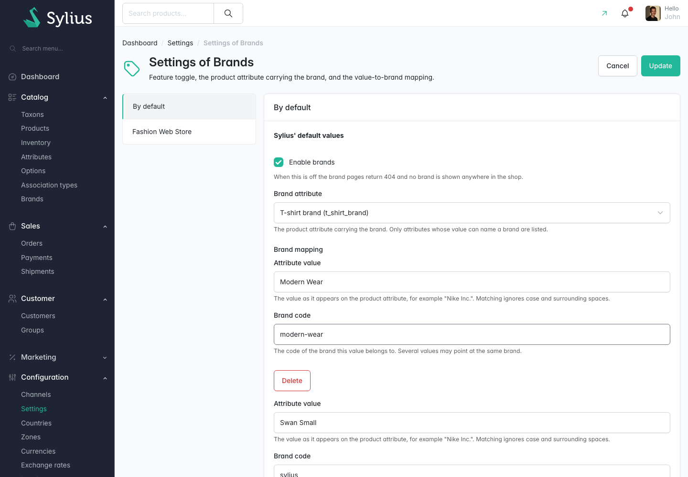
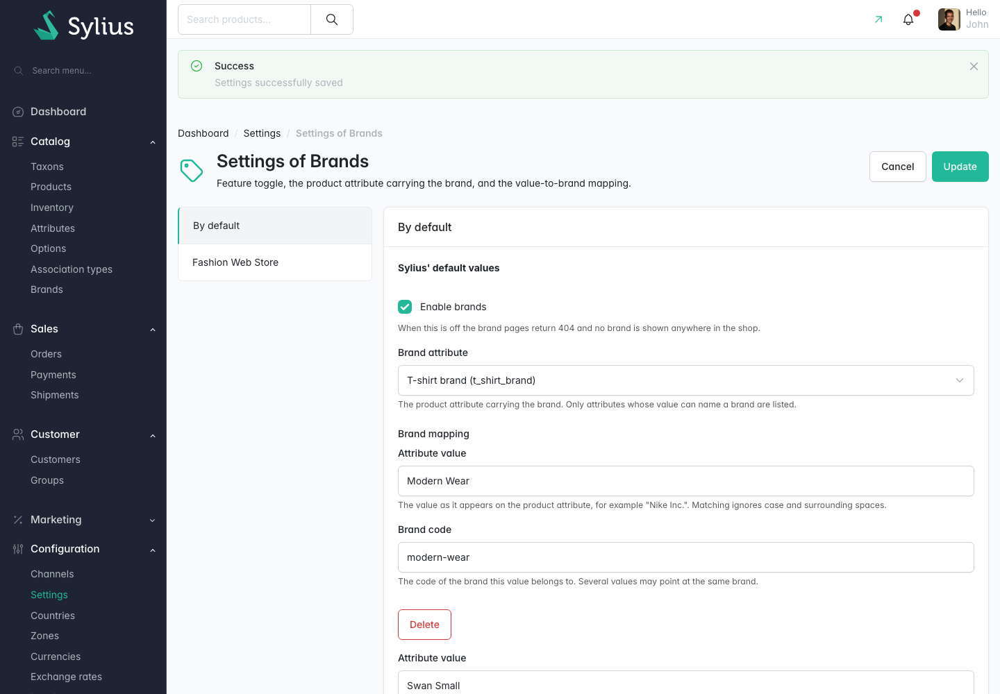

# Walkthrough: point the plugin at your brand attribute

**Who this is for:** a store administrator.
**What you end up with:** the feature switched on, and the plugin reading the brand from the
product attribute your catalogue already uses.

This walkthrough was replayed against a running store. Every step below completed.

Do this once, after you have created at least one brand.

## 1. Open the settings

In the admin, open **Settings**, then the **Brands** section. The page is headed **Settings of
Brands**.


## 2. Switch the feature on

Tick **Enable brands**.

While it is off the shop routes return 404 and every brand surface renders nothing. Products still
resolve to their brand underneath, so nothing is lost by leaving it off until you are ready.

This setting is per channel: on a channel tab, untick **Use default value** first if you want that
channel to differ from the default.



## 3. Choose the brand attribute

Choose the product attribute that holds the brand from **Brand attribute**. In this run the choice
was `t_shirt_brand`.

The list shows each attribute as `Attribute name (attribute_code)` and only offers attributes whose
value could name a brand: text, textarea, select, integer and percent.

This field is only on the **By default** tab. A product is linked to one brand, so there is no
sensible per-channel answer.


## 4. Add a mapping row

You only need a mapping where the attribute value does not already match a brand code. Choose
**Add** to append a row, then fill in **Attribute value**. In this run the value was `Modern Wear`.

Matching ignores case and surrounding spaces.


## 5. Point it at a brand code

Fill in **Brand code** on the same row with the code of the brand that value belongs to. In this
run the value was `modern-wear`.

Several attribute values can point at the same brand code, which is how `Nike Inc.` and
`NIKE Sportswear` end up on one `nike` brand. Leave the mapping empty altogether to match attribute
values against brand codes one to one.



## 6. Save

Choose **Update**. The admin confirms with **Settings successfully saved**.



## What happens next

Saving the settings does not rewrite the products. Changing the attribute or the mapping changes
what every product resolves to, so finish with a resync:

```bash
bin/console madcoders:brand:resync-products --dry-run
bin/console madcoders:brand:resync-products
```

Then open a product in the admin and check its **Brand** panel, or filter the product grid by
**Brand**. See [Resyncing product brands](../features/resyncing-product-brands.md).
