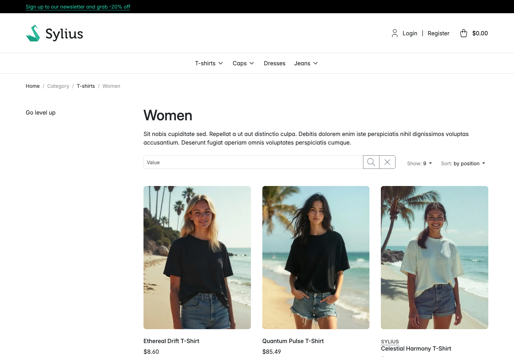
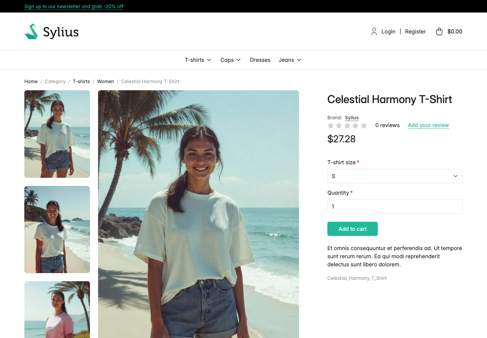

# Walkthrough: see the brand on a product

**Who this is for:** a shopper. Administrators can use it to check their own setup.
**What you end up with:** you have found the brand on a product tile and on the product page, and
followed it through to the brand.

This walkthrough was replayed against a running store. Every step below completed.

## 1. Open a product listing

Go to any listing that uses Sylius' product cards, for example a taxon page. In this run that was
`/en_US/taxons/t-shirts/women`.

A tile shows its product's brand as a small uppercase line between the image and the product name,
linking to the brand's page. Here Celestial Harmony T-Shirt carries **SYLIUS**, while the tiles
next to it carry nothing, because those products do not resolve to a brand whose **Display on
product tiles** toggle is on.

## 2. Open the product

Select the product. In this run that was `/en_US/products/celestial-harmony-t-shirt`.

## 3. Read the badge

Directly under the product title, above the review stars, the page shows **Brand: Sylius**. The
brand name is a link to `/en_US/brands/sylius`, where you can see everything else that brand makes.
Where a brand has a logo uploaded, the logo appears before the label.

The badge is shown because the product resolves to the Sylius brand, that brand is enabled, and its
**Display on the product page** toggle is on.

## Why another product might show no brand

A product page with no badge is a normal state, not a fault. Work through these in order. The
**Brand** panel on the product's admin page answers most of them in one go.

1. **Enable brands** is off for this channel. Then nothing brand-related renders anywhere.
2. No **Brand attribute** is configured, or this product has no value for it.
3. The value does not match any brand code, and no **Brand mapping** row points it at one.
4. The brand exists but is not **Enabled**.
5. The brand is enabled but its toggle for this surface is off: **Display on the product page** for
   the product page, **Display on product tiles** for a tile.
6. The product's attribute value was changed outside the admin, or the mapping changed, and no
   resync has run since. Run
   [`madcoders:brand:resync-products`](../features/resyncing-product-brands.md).
